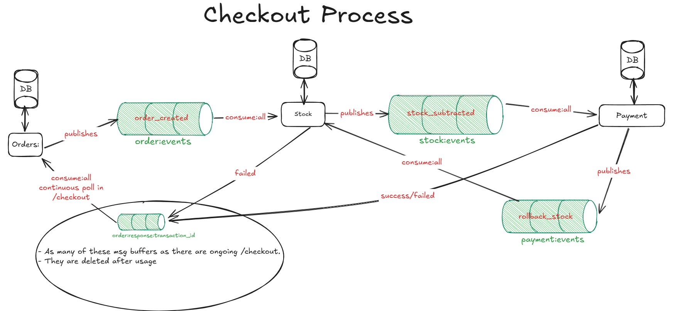

# Distributed Systems Course: Group 12 TU-Delft

### Project Architecture

We decided to implement a choreographed SAGA version of the web-shop with microservices. 
This proposed architecture is a standard SAGA implementation, completely asynchronous and without reserving or long-term locking. 
When the stock service consumes the order-created events it directly subtracts stock if possible, then it posts the stock-success event to its event buffer. 
The payment stock consumes each event and proceeds to directly subtract (or fail) funds from the customer’s account. The successful case is trivial, but when funds are insufficient, the stock service consumes the payment-failed event and the custom data-recovery protocol is triggered

### Project structure

* `env`
    Folder containing the Redis env variables for the docker-compose deployment
    
* `helm-config` 
   Helm chart values for Redis and ingress-nginx
        
* `k8s`
    Folder containing the kubernetes deployments, apps and services for the ingress, order, payment and stock services.
    
* `order`
    Folder containing the order application logic and dockerfile. 
    
* `payment`
    Folder containing the payment application logic and dockerfile. 

* `stock`
    Folder containing the stock application logic and dockerfile. 

* `test`
    Folder containing some basic correctness tests for the entire system.

### Project Deployment:

We use Kubernetes to manage the deployment, scaling, and resilience of each microservice involved in the workflow. Kubernetes ensures high availability of services, automatic restarts in case of failures, and consistent configuration management, all of which are important in our setup where services interact via events.

Please read the `HowToRun.md` file to figure out the proper deployment for this project.

### Contributions:

Please read the `contributions.txt` file.